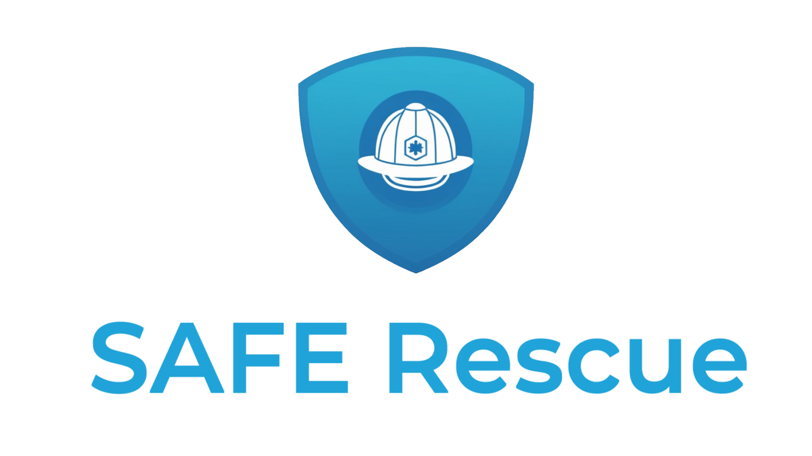

  

SAFE Rescue es una aplicación diseñada para la gestión eficiente y rápida de incidentes en situaciones de emergencia. Esta herramienta permite a los equipos de respuesta a emergencias coordinar recursos, monitorear el desarrollo de incidentes y tomar decisiones informadas en tiempo real. Con un enfoque en la seguridad y la comunicación efectiva, SAFE Rescue optimiza la respuesta a emergencias y ayuda a mitigar los riesgos en situaciones críticas.  

  

## Comunicación y Coordinación en Emergencias  

  
La comunicación oportuna hace la diferencia. 

## Bomberos en Acción  

  
La valentía y la preparación salvan vidas. 
